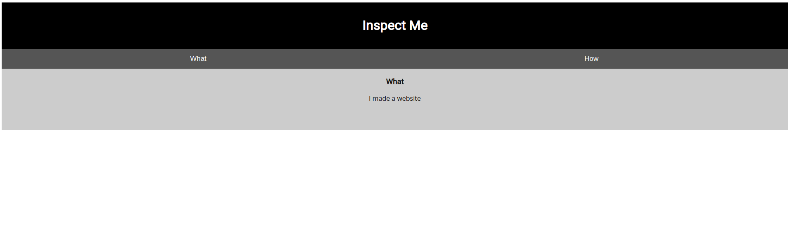
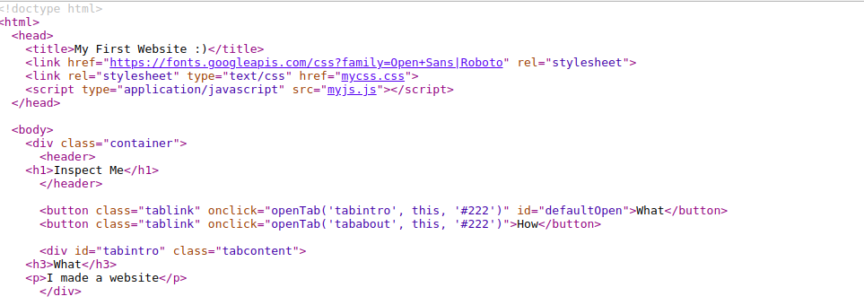
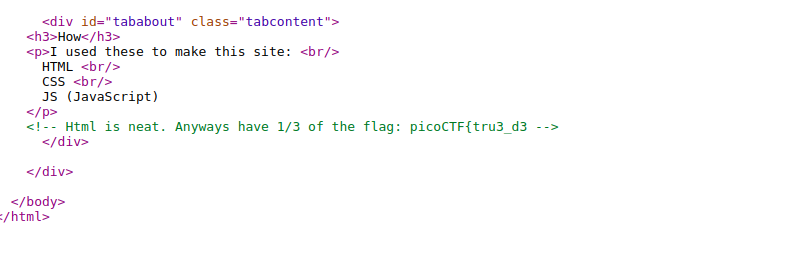
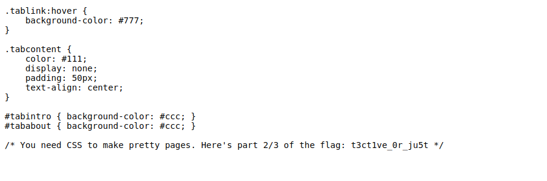
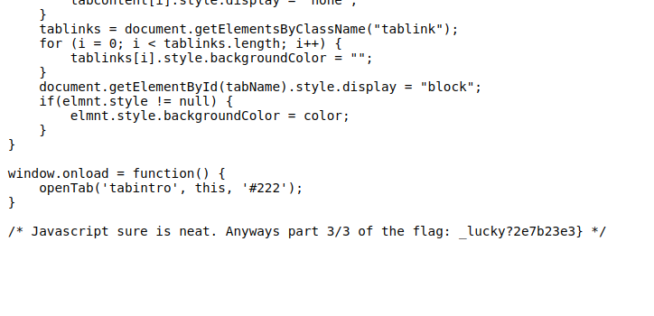

# Insp3ct0r picoCTF Solution
   The flag containing of an 3 parts.
1. Observe the page    
2. Right click on mouse 
3. View page source    
4. Find the 1/3 flag    
5. Open CSS file 
6. Find the 2/3 flag    
7. Open the JS file 
8. Find the 3/3 flag     
9. Combine the 3 parts and submit the flag :)

