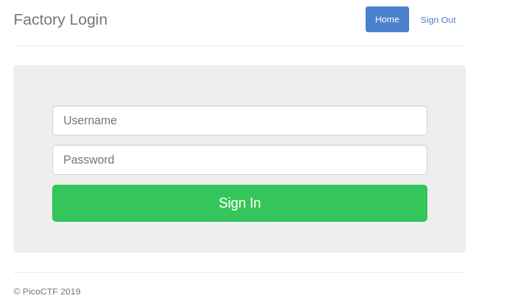
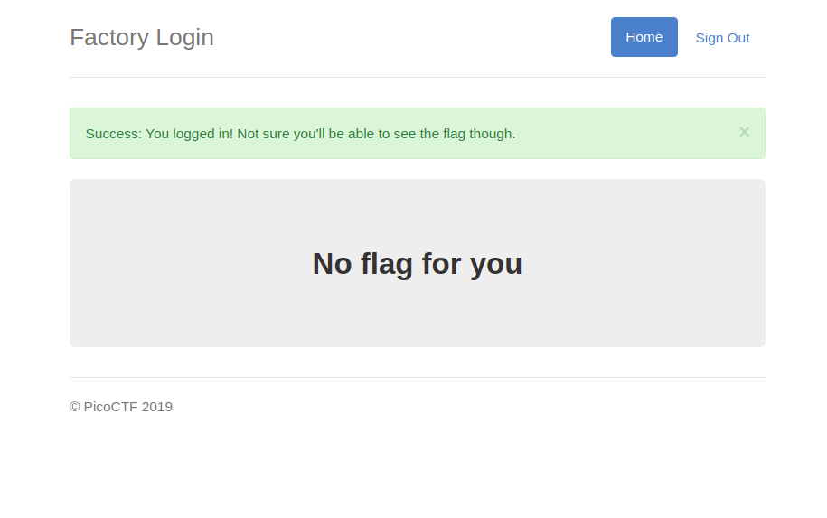
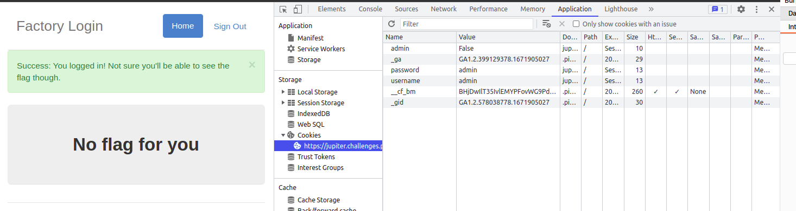
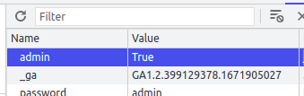
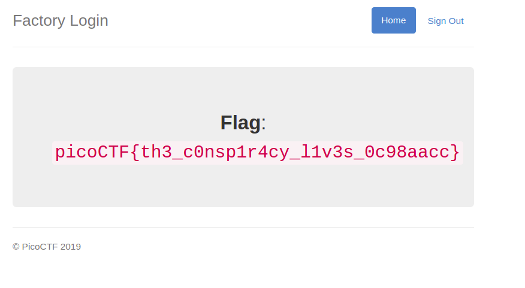

# logon picoCTF Solution
1. Login with any credentials ex: user:admin pass:pass    
2. Inspect the Page    
3. Navigate to Application Tab Observe the cookie value    
4. Change the cookie value "False" to "True"     
5. Select the show requests with this cookie
6. Navigate to Network tab      
7. Congrat's You found the flg
